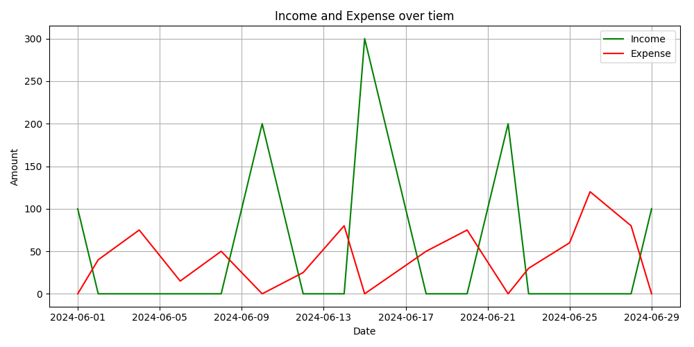

# Finance Tracker

## Overview

The Finance Tracker is a simple command-line application designed for managing and tracking financial transactions. It allows users to log income and expenses, view transaction summaries over specified date ranges, and visualize the data through plots. The application utilizes CSV files for data storage and relies on Python libraries such as `pandas` and `matplotlib`.

## Features

- **Add Transactions**: Log income and expenses with optional descriptions.
- **View Transactions**: Retrieve and view transactions within a specified date range.
- **Plot Transactions**: Visualize income and expenses over time using line charts.
- **Data Storage**: Transactions are stored in a CSV file for persistence.

## Files

- `data_entry.py`: Contains functions for data entry, including date, amount, category, and description inputs.
- `main.py`: Contains the main application logic, including user interactions, transaction management, and plotting functions.
- `finance_data.csv`: CSV file where transaction data is stored (automatically created if it doesn't exist).

## Installation

Ensure you have Python 3.6 or later installed. You'll need to install the required libraries using pip:

```bash
pip install pandas matplotlib
```
 
## Usage
Running the Application  
To run the application, execute the following command in your terminal:
```bash 
python main.py
```
# Features & Commands

## Add a New Transaction

1. Select option 1 from the main menu.
2. Enter the date, amount, category (Income or Expense), and an optional description when prompted.
3. The transaction will be added to `finance_data.csv`.

## View Transactions and Summary

1. Select option 2 from the main menu.
2. Enter the start and end dates to filter transactions.
3. View a summary of total income, total expenses, and net savings.
4. Optionally, choose to visualize the transactions with a plot.

## Exit

1. Select option 3 to exit the application.

### Date Format

- Dates should be entered in the format `dd-mm-yyyy`.

### Amounts

- Amounts must be positive numbers.

### Categories

- Enter `I` for Income.
- Enter `E` for Expense.

# Example

1. Add a new transaction
2. View transaction and summary within a date range
3. To Exit
Enter your choice (1-3): 1
Enter the date of the transaction (dd-mm-yyyy) or enter for today's date: 15-07-2024
Enter the amount: 100
Enter the category('I' for Income or 'E' for Expense): I
Enter the description (optional): Salary
Entry added successfully!

1. Add a new transaction
2. View transaction and summary within a date range
3. To Exit

1. Add a new transaction
2. View transaction and summary within a date range
3. To Exit
Enter your choice (1-3): 2
Enter the satrt date (dd-mm-yyyy): 01-06-2024
Enter the end date (dd-mm-yyyy): 30-06-2024

transaction from 01-06-2024 to 30-06-2024
      date  amount category    description
01-06-2024   100.0   Income Freelance Work
02-06-2024    40.0  Expense      Groceries
04-06-2024    75.0  Expense      Utilities
06-06-2024    15.0  Expense         Snacks
08-06-2024    50.0  Expense            Gas
10-06-2024   200.0   Income Freelance Work
12-06-2024    25.0  Expense Transportation
14-06-2024    80.0  Expense     Dining Out
15-06-2024   300.0   Income         Salary
18-06-2024    50.0  Expense      Groceries
20-06-2024    75.0  Expense            Gas
22-06-2024   200.0   Income Freelance Work
23-06-2024    30.0  Expense     Dining Out
25-06-2024    60.0  Expense      Utilities
26-06-2024   120.0  Expense     Buy Laptop
28-06-2024    80.0  Expense      Groceries
29-06-2024   100.0   Income           Gift

**Summary**

Total Income: $900.00
Total Expense: $700.00
Net Saving : $200.00
Do you want to see a plot on transactions (y/n)? y



## Plotting

The `plot_transaction` function generates a line chart showing income and expense trends over time. This requires `matplotlib` to be installed.

## Troubleshooting

- **CSV File Not Found**: The application will create the `finance_data.csv` file if it does not exist.
- **Invalid Date Format**: Ensure dates are entered in `dd-mm-yyyy` format.
- **Invalid Amount**: Amount must be a positive number.

## Contributing

Feel free to open issues or submit pull requests to improve the functionality or fix bugs.


